<a target="_blank" rel="noopener noreferrer" href="https://chrome.google.com/webstore/detail/tampermonkey/dhdgffkkebhmkfjojejmpbldmpobfkfo?hl=en">
      Install Extension
  </a>

[](#)
<p align="center">
These are my open personal notes.
</p>

## Welcome to Vaido World


You can contact me or start a discussion on any topic here:  
https://github.com/orgs/vaido-world/discussions

---

| Useful software                 |                                                                                   |
|---------------------------------|-----------------------------------------------------------------------------------|
|  https://hovancik.net/stretchly/ | cross-platform app that reminds you to take breaks when working on your computer. |
|  [https://github.com/rustdesk/rustdesk/](https://github.com/rustdesk/rustdesk/releases/tag/1.1.9) | [Open Source alternative to TeamViewer](https://www.youtube.com/watch?v=JIAdEGX_sIU) |
|    [https://github.com/olive-editor/olive/](https://github.com/olive-editor/olive/releases)  |  [Free open-source cross-platform non-linear video editor](https://www.youtube.com/watch?v=AoS9lHagk_Q&t=41s) |
|  https://github.com/Tampermonkey | The world's most popular userscript manager for [Firefox](https://addons.mozilla.org/en-US/firefox/addon/tampermonkey/) and [Chrome](https://chrome.google.com/webstore/detail/tampermonkey/dhdgffkkebhmkfjojejmpbldmpobfkfo?hl=en) |
|  [https://github.com/kiwibrowser](https://github.com/kiwibrowser) | Replacement of Google Chrome Browser with Extension support for [Android](https://play.google.com/store/apps/details?id=com.kiwibrowser.browser&hl=en&gl=US)  | 
<!--|  []() |                                                                                   | -->
<!--|                                 |                                                                                   |-->
[OS_Android]: https://user-images.githubusercontent.com/21064622/185875388-ff58395f-b59a-45af-94dd-989f21a762dd.png

[Some userscripts by me](https://gist.github.com/search?q=%22%3D%3DUserScript%3D%3D%22+user%3Aboqsc&ref=searchresults)  
[Someones GreaseMonkey Scripts collection](https://arantius.com/misc/greasemonkey/)  

More software can be found in https://github.com/vaido-world/Global-Redesign-Institute

|  Useless software  |                                                                                               |
|:------------------:|:---------------------------------------------------------------------------------------------:|
| Visual Studio Code | Won't use it again. Frontend is browser-like. Written in JavaScript using Electron framework. |
| winscp             | Failed to transfer a large archive file, no logging is enabled by default, no idea what happened |
|                    |                                                                                               |

[winscp corrupts files](https://user-images.githubusercontent.com/21064622/187369675-34034fa9-c31e-48b5-bb6c-6f2fecae3ba6.png)

```mermaid
graph TD
  A["🕵🏼 Personal GitHub"] --> B[Load Balancer]
  B --> C[Server01]
  B --> D[Server02]
  click A "https://github.com/BoQsc" "This is a link"
  
  style A fill:#00758f
  style A color:#000000
  style A font-weight:900
  style A fontSize:60px
  
  linkStyle default color:#0000FF
```




### [🕵🏼 Personal GitHub](https://github.com/BoQsc)

### [🗜 Virtual Private Server](https://github.com/vaido-world/Virtual-Private-Server)

### [🚵🏽‍♂️ About living in EU](https://europa.eu/youreurope/index_en.htm)
[[Traditional regions of Europe]](https://saylordotorg.github.io/text_world-regional-geography-people-places-and-globalization/s05-04-regions-of-western-europe.html)

## 🚀 The Emergency Emigration Guide
If you want to stay in ![Finland Flag] Finland for a longer period than three months, you need a residence permit. [[Source]](https://finlandabroad.fi/web/ltu/residence-permits-to-finland)  
If you wish to stay (In ![Sweden Flag] Sweden) for longer than three months, you must apply for a residence permit. [[Source]](https://www.migrationsverket.se/English/Private-individuals/EU-EEA-citizens-and-long-term-residents/Long-term-residents.html)  

You can stay in ![Norway Flag] Norway for up to three months without registering with the police,  
providing you do not become an unreasonable burden for public welfare systems. [[Source]](https://www.udi.no/en/want-to-apply/visit-and-holiday/to-visit-norway-without-a-visa/#:~:text=EU%2FEEA%20citizens%20who%20wishes,must%20register%20with%20the%20police.)  

#### North Europe

| 🚅 Nordic Country                    | Attributes            | Access                                                                                                                                                                                                                                                                                |
|-----------------------------------|-----------------------|---------------------------------------------------------------------------------------------------------------------------------------------------------------------------------------------------------------------------------------------------------------------------------------|
| 🇮🇸 ![image][Iceland Flag] Iceland | 💔 ![No Euro Currency] ![NATO Symbol Icon] | [No Direct Contacts]                                                                                                                                                                                                                                                                  |
| 🇫🇮 ![image][Finland Flag] Finland | 💙 ![Euro Currency] ![NATO Symbol Icon NOT YET]   | [[Apply for residence permit]](https://finlandabroad.fi/web/ltu/residence-permits-to-finland) <br> [[Embassy of Finland]](https://finlandabroad.fi/web/ltu/frontpage) <br> [[Finland Toolbox]](https://toolbox.finland.fi/life-society/finfo-living-finnish-way-english/) <br> [[Conducted Basic Income Experiment]](https://toolbox.finland.fi/life-society/video-finland-basic-income-experiment-2017-2018-results/)                                                                                                                                                                                                                   |
|    **🚄 Scandinavian countries**   |                       |                                                                                                                                                                                                                                                                                       |
| 🇩🇰 ![image][Denmark Flag] Denmark | 💔 ![No Euro Currency] ![NATO Symbol Icon] | [[Embassy of Denmark]](https://litauen.um.dk/en)                                                                                                                                                                                                                                      |
| 🇳🇴 ![image][Norway Flag] Norway   | 🤍 ![No Euro Currency] ![NATO Symbol Icon] | [[Embassy of Norway]](https://www.norway.no/en/lithuania/)                                                                                                                                                                                                                            |
| 🇸🇪 ![image][Sweden Flag] Sweden   | 💙 ![No Euro Currency] ![NATO Symbol Icon NOT YET] | [[Step by Step Guide]](https://sweden.se/work-business/moving-to-sweden/moving-to-sweden-in-10-steps) <br> [[Personal Guide]](https://www.officialswedishservices.se) <br> [[Embassy of Sweden]](https://www.swedenabroad.se/en/) <br> [[Study in Sweden]](https://studyinsweden.se/) <br> [[The Swedish Tax Agency]](https://www.skatteverket.se/servicelankar/otherlanguages/inenglish.4.12815e4f14a62bc048f4edc.html) <br> ↳ [[Moving to Sweden]](https://www.skatteverket.se/servicelankar/otherlanguages/inenglish/individualsandemployees/movingtosweden.4.7be5268414bea064694c40c.html) <br> [[Swedbank.se English Version]](https://www.swedbank.se/en/) <br> [[Systembolaget explained]](https://www.omsystembolaget.se/english/systembolaget-explained/) <br> [[Sweden’s Migration Agency]](https://www.migrationsverket.se/English/Private-individuals.html) <br><br> TIP [[How Expensive is Sweden?]](https://www.youtube.com/watch?v=AuHdsAmNxZk) <br> TIP [[How to Get a Job in Sweden?]](https://youtu.be/36_c9JxbX1k?t=45) <br> TIP [[How to Find Accommodation in Sweden?]](https://www.youtube.com/watch?v=JMNVXxLMEiI) <br> Jobs [[English-language jobs in Sweden (thelocal.se)]](https://www.thelocal.se/jobs/) <br> Jobs [[English-language jobs in Sweden (glassdoor.com)]](https://www.glassdoor.com/Job/) <br> Jobs [[English-language jobs in Sweden (jobsinstockholm.com)]](https://www.jobsinstockholm.com/)


💙 Blue Heart Emoji means Embassy have a welcoming website.  
🤍 White Heart Emoji means Embassy does not feel good enough.  
💔 Broken Heart Emoji means Embassy have a bad vibe.  
 ![No Euro Currency] No Euro Currency in the country.  
 ![NATO Symbol Icon NOT YET] About to Join NATO. Joined NATO recently.  
 ![NATO Symbol Icon] Longtime member of NATO.

[Iceland Flag]: https://user-images.githubusercontent.com/21064622/176395371-1af081d8-21d6-4d09-a556-23493e371dd5.png "16px x 12px Iceland flag."
[Finland Flag]: https://user-images.githubusercontent.com/21064622/176397232-6283c9fa-78ef-45bc-9599-1276fedce91e.png "16px x 12px Finland flag."
[Denmark Flag]: https://user-images.githubusercontent.com/21064622/176398631-5276762e-915c-41eb-9ff3-e519aef25cc0.png "16px x 12px Denmark flag."
[Norway Flag]: https://user-images.githubusercontent.com/21064622/176400014-a8adb054-0b50-4759-8623-6d43b85ce64a.png "16px x 12px Norway flag."
[Sweden Flag]: https://user-images.githubusercontent.com/21064622/176400440-afa82338-1bb9-4bf1-bd83-ac47e99824a6.png "16px x 12px Sweden flag."

[Euro Currency]: https://user-images.githubusercontent.com/21064622/176410008-abc65181-6277-4c26-96a9-c787a4b1d85e.png
[No Euro Currency]: https://user-images.githubusercontent.com/21064622/176412072-f1288fa0-e4bd-4925-bf14-06a83089ce39.png
[NATO Symbol Icon]: https://user-images.githubusercontent.com/21064622/176870746-1709810f-c369-4a22-acfa-cf18bb0a65b1.png
[NATO Symbol Icon NOT YET]: https://user-images.githubusercontent.com/21064622/176871406-e2eb9086-bb68-4d2d-949d-e5206d6ef0bf.png


The best way to earn some monies is by contracting companies.  
Where they take care of traveling and housing.  

None of the countries have English language as primary.   
Some even do not have € Euro as the country's currency.  

[Definitions of Migrant, Refugee, Immigrant and Expatriate.](https://www.antidote.info/en/blog/reports/migrant-refugee-immigrant-and-expatriate-what-difference)

[Accurate representation of the Norden countries.](https://www.youtube.com/watch?v=Q_SaRMP90OA)

Uhh, so it might be only Sweden or Finland for me.  
It's important even if I won't migrate there immediately.  

Having a work experience and connections   
in the country does help with the overall access.  

Sweden looks more cute, but Finland has Euro currency.  
This shows a lot about their caring and their standards.  

I'm starting to like Finland more, they seem to be more open.  
They actually post job applications on EURES portal. (With EURES FLAG)

#### West Europe
[If you intend to stay in the Netherlands for less than four months, you need to register as a temporary resident (non-resident) of the Netherlands.][Short Term Netherlands]
[If you plan to stay in the country for more than four months, you have to register as a resident of the Netherlands.][Register as Resident Netherlands]

[If you want to stay in the Netherlands for longer than 90 days, you may need a residence permit. In many cases you will also have to apply for a long-stay visa before you travel to the Netherlands. This visa is also called an authorisation for temporary stay (MVV).][Official Netherlands Permit]

[Official Netherlands Permit]: https://www.netherlandsworldwide.nl/visa-the-netherlands/mvv-long-stay/apply-lithuania#:~:text=If%20you%20want%20to%20stay%20in%20the%20Netherlands%20for%20longer%20than%2090%20days%2C%20you%20may%20need%20a%20residence%20permit.%20In%20many%20cases%20you%20will%20also%20have%20to%20apply%20for%20a%20long%2Dstay%20visa%20before%20you%20travel%20to%20the%20Netherlands.%20This%20visa%20is%20also%20called%20an%20authorisation%20for%20temporary%20stay%20(MVV).
[Short Term Netherlands]: https://www.immigration-netherlands.com/how-to-move-to-the-netherlands-from-lithuania#:~:text=If%20you%20intend%20to%20stay%20in%20the%20Netherlands%20for%20less%20than%20four%20months%2C%20you%20need%20to%20register%20as%20a%20temporary%20resident%20(non%2Dresident)%20of%20the%20Netherlands.
[Register as Resident Netherlands]: https://www.immigration-netherlands.com/how-to-move-to-the-netherlands-from-lithuania#:~:text=If%20you%20plan%20to%20stay%20in%20the%20country%20for%20more%20than%20four%20months%2C%20you%20have%20to%20register%20as%20a%20resident%20of%20the%20Netherlands.%20This


[Netherlands Flag]: https://user-images.githubusercontent.com/21064622/180970568-aff65e6b-c6d8-4cfd-9e37-f9097eebf135.png "16px x 12px Netherlands flag."  


| 🚅 Western Country      | Capital City              | Attributes            | Access                                                                                                                                                                                                                                                                                |
|-----------------------------------|-----------------------|-----------------------|---------------------------------------------------------------------------------------------------------------------------------------------------------------------------------------------------------------------------------------------------------------------------------------|
| ![Netherlands Flag] Netherlands | Amsterdam | 🤍💔 ![Euro Currency] ![NATO Symbol Icon]  | [\[Embassy of Netherlands\]][Embassy of Netherlands] |
Germany <Poor internet>  | Berlin | 💔💔 ![Euro Currency] ![NATO Symbol Icon] | [\[German Foreign Policy page\]][German Foreign Policy page]
Belgium   
France  

[Embassy of Netherlands]: https://www.netherlandsandyou.nl/your-country-and-the-netherlands/lithuania "Link to Embassy of Netherlands"
[German Foreign Policy page]: https://www.auswaertiges-amt.de/en/aussenpolitik/laenderinformationen/litauen-node/lithuania/228032

Ireland?


<details>
  <summary><h3> 👨🏼‍🏫 Finding a job in Europe using Eures portal:</h3></summary>
  
  * Use search keywords `computer software developer`, ` scientist engineer`,  `IT Assistant`, `IT Systems Administrator`  
  * Tick the `Language of the job vacancy: English`  
  * Tick the `Work schedule: Full-time`  
  * Preferebly tick the `EURES flag: With EURES flag`  
  * Preferebly tick the `Sector: INFORMATION AND COMMUNICATION`  
  * Preferebly tick the `Sector: PROFESSIONAL, SCIENTIFIC AND TECHNICAL ACTIVITIES`  
  * Preferebly tick the `Sector: ADMINISTRATIVE AND SUPPORT SERVICE ACTIVITIES`  
  * Preferable tag: `ICT application developer`
    * Information and communications technology (ICT)
  * Preferable tag: `ICT system administrator`
    * Information and communications technology (ICT)
  * Preferebly `Contract type: Direct Hire`
  * Preferebly `Publication date: Last week`
  
Example search:  
https://ec.europa.eu/eures/portal/jv-se/search?page=1&resultsPerPage=50&orderBy=BEST_MATCH&keywordsEverywhere=computer%20software%20developer%20&positionScheduleCodes=fulltime&availableLanguages=en&positionOfferingCodes=directhire&euresFlagCodes=WITH&publicationPeriod=LAST_WEEK

Python:  
https://ec.europa.eu/eures/portal/jv-se/search?page=1&resultsPerPage=50&orderBy=BEST_MATCH&keywordsEverywhere=python&positionScheduleCodes=fulltime&availableLanguages=en&positionOfferingCodes=directhire&euresFlagCodes=WITH&publicationPeriod=LAST_WEEK

Python: with Unspecified eductionand experience.  
https://ec.europa.eu/eures/portal/jv-se/search?page=1&resultsPerPage=50&orderBy=MOST_RECENT&keywordsEverywhere=python&experience=NS&positionScheduleCodes=fulltime&availableLanguages=en&educationLevel=NS&positionOfferingCodes=directhire&euresFlagCodes=WITHOUT&publicationPeriod=LAST_WEEK
      
JavaScript:  
https://ec.europa.eu/eures/portal/jv-se/search?page=1&resultsPerPage=50&orderBy=BEST_MATCH&keywordsEverywhere=javascript&positionScheduleCodes=fulltime&availableLanguages=en&positionOfferingCodes=directhire&euresFlagCodes=WITH&publicationPeriod=LAST_WEEK

https://ec.europa.eu/eures/portal/jv-se/home?pageCode=find_a_job

</details>

> #OpportunityDays Norway - Sweden online #jobfair event is the perfect place for #jobseekers to browse available opportunities, find financial support, explore housing and living circumstances, and so much more. 
https://europeanjobdays.eu/en/event/mulighetsdager-norge-sverige-08-september-2022?fbclid=IwAR1TraWhf7KCd55LXIHJ-D2oErizl7RLXxhOMO_SHP0_AIy6t8sqqpbfkC0

## 💼 The rest of unsorted stuff

### Domain Management Notes
It's better to redirect `vaido.world` domain to <https://vaido-world.github.io/>, in case the `vaido.world` domain expires.  
It is also better for keeping a more permanent links and is more reliable way.  
https://github.com/vaido-world/NameCheap-domain-notes  

### New General GitHub Discussions Setup 
For Contacting and answering questions Organisational wide.
https://github.com/orgs/vaido-world/discussions

Target Repository: https://github.com/vaido-world/vaido-world-github-discussions


### Cleaning Cache for a specific URL using Google Chrome Dev Tools
https://www.ryadel.com/en/clear-google-chrome-redirect-cache-for-single-url-page-howto

### Notes on migrating from Swedbank in Europe
https://www.swedbank.com/about-swedbank/organisation/our-markets.html


<details>
  <summary><h3>Minimum wage in Lithuania</h3></summary>
  


</details>

### Programming languages to use
C#, Java, D Language. Some pure JavaScript.

### Search for files in the same folder on Windows 10 using File Explorer
[`search-ms:query=ext:gif -folder:"Desktop\*" foldername:Desktop`](https://tinyurl.com/3p3ar64j)  
[`search-ms:query=ext:webp -folder:"Desktop\*" foldername:Desktop`](https://tinyurl.com/5n72c523)  
[`search-ms:query=ext:webm -folder:"Desktop\*" foldername:Desktop`](https://tinyurl.com/ykm9y7sn)  
[`search-ms:query=ext:svg -folder:"Desktop\*" foldername:Desktop`](https://tinyurl.com/44b8amtz)  
[`search-ms:query=ext:ove -folder:"Desktop\*" foldername:Desktop`](https://tinyurl.com/yje5s36k)  
[`search-ms:query=ext:mp4 -folder:"Desktop\*" foldername:Desktop`](https://tinyurl.com/3ph8shr6)  
[`search-ms:query=ext:png -folder:"Desktop\*" foldername:Desktop`](https://tinyurl.com/3wj88pwv)  
[`search-ms:query=ext:jpeg OR ext:jpg -folder:"Desktop\*" foldername:Desktop`](https://tinyurl.com/23d7yh6z)  
[`search-ms:query=ext:xcf -folder:"Desktop\*" foldername:Desktop`](https://tinyurl.com/4h7tazn3)  

      
```
ext:.gif -folder:"Desktop\*"
ext:.webp -folder:"Desktop\*"
ext:.webm -folder:"Desktop\*"
ext:.svg -folder:"Desktop\*"
ext:.ove -folder:"Desktop\*"
ext:.mp4 -folder:"Desktop\*"
ext:.png -folder:"Desktop\*"
ext:.jpeg OR ext:.jpg -folder:"Desktop\*"
ext:.xcf -folder:"Desktop\*"
```
Search protocol link example  
`search-ms:query=-folder:"Desktop\*" foldername:Desktop`  
`search-ms:query=testfilename -folder:"Desktop\*" foldername:Desktop`    
`search-ms:query=*.* -folder:"Desktop\*" foldername:Desktop`    
[Search files in Desktop](https://tinyurl.com/267vk82f)   Search in.  
  
More examples  
  `search-ms:displayname=Resultados%20de%20la%20b%C3%BAsqueda%20en%20fotos&crumb=extensi%C3%B3ndearchivo%3A~<*.jpg&crumb=location:C%3A%5Cwindows`  
  `search-ms:query=seattle&crumb=folder:C:\MyFolder&` 
https://stackoverflow.com/questions/95432/how-do-i-open-find-files-dialog-from-command-line-in-windows-xp-to-search-a-sp/7509943#7509943  
https://superuser.com/a/1177021/740880  
https://docs.microsoft.com/en-us/windows/win32/lwef/-search-2x-wds-aqsreference                                                                                                          
### ⬇️🎥 Download Public Domain and Creative Commons Videos

* TamperMonkey Chrome Extension and Userscript
  1. Install Chrome Extension https://www.tampermonkey.net/ | https://chrome.google.com/webstore/detail/tampermonkey/dhdgffkkebhmkfjojejmpbldmpobfkfo?hl=en
  2. Install Userscript https://greasyfork.org/en/scripts/369400-local-youtube-downloader  
    [Alternate Userscript.](https://gist.github.com/BoQsc/1ad3d9b27a5a2a07e8763bdd11ac4a3f/raw/a17b66f56a6cbf994f221824c7f85d3c43254752/Y2mate%2520Converter%2520Button.user.js)

  
  
* Use https://www.y2mate.com/  
* Download, Install, Use https://youtube-dl.org/  

### TinyURL generator
Can be used to share magnet links. `magnet:`  
Can be used to utilize application protocols like `steam:`  
https://tinyurl.com/app/

### imgur to quick post a quality homemade gif
Tenor uploads might take some time before approved.  
For a quick upload of .gif imgur can be used.  
https://imgur.com/

### 📰 All about patents [Europe]
* [What you need to know about Copyright, Patents, Trademarks and Open Source!](https://www.youtube.com/watch?t=723&v=61lgkb9BC54&feature=youtu.be)  
* ["Intellectual Property Basics: Understanding Patents, Trademarks, Copyrights and Trade Secrets"](https://www.youtube.com/watch?v=1viuhVp8Ugk)
  
[[What do the Patents protect]](https://europa.eu/youreurope/business/running-business/intellectual-property/patents//index_en.htm#:~:text=it%20expires.-,What%20a%20patent%20protects,-Use%20a%20patent)  
[[Apply for Patent in Europe]](https://www.epo.org/applying/basics.html)  
[[Patent Fees]](https://www.epo.org/applying/fees/fees.html) -> [[Rules relating to fees]](https://www.epo.org/law-practice/legal-texts/official-journal/2022/etc/se2/p1.html)  
[[Contact the European Patent Office]](https://www.epo.org/service-support/contact-us.html)  
  
 Contact The Ombuds Office for informal questions on Patenting.
 > The Ombuds Office is available to any individual wishing to address a concern in the dealings with the EPO. It is an informal and confidential service to offer guidance and help get things back on track if you have been unable to resolve matters to your satisfaction by going through the formal channels.  
[[https://www.epo.org/service-support/contact-us.html]](https://www.epo.org/service-support/contact-us.html)   
Mail: ombuds@epo.org
  
European Patent Office Discussion forum for informal contact and questions  
https://www.epo.org/service-support/forums.html
  
 [[Patent Database, Espacenet patent search]](https://www.epo.org/searching-for-patents/technical/espacenet.html#tab-1) -> https://worldwide.espacenet.com/  
  
<details>
        <summary>Copyleft or copyright or any kind of copy license is not responsive for patents and trademarks.</summary>
   
Copyleft or copyright or any kind of copy license is not responsive for patents and trademarks.
Do you really believe that some notice in a license is going suddenly overturn a patent and a trademark.

These licenses have nothing to do with the patents and trademarks.
It’s merely a notice and a gesture in a Market Economy warfare.
GPL or MIT do not mean anything in that regard. These are only copy licenses.

You don’t get any more silly, than making decision without doing a research.
Fedora is really a project that simply does not care about its content and is a hype-product.
I’m attaching Creative Commons response to any kind of these patent worriers that believe their Copyright license can have anything to do with patents or trademarks…

CC0 is a license with original Public Domain intent and correct statements of what a copyright license is capable of and not more. GPL, MIT and other licenses face exactly the same patents and trademarks concerns. Copyright license should not be a written fairytale that make you feel like you are suddenly an owner of every patent and a trademark in your project. You are not and you will never be, by simply placing some notice in a license file.

You have to go through every country and every government with enough proof and money to support your claims. Patenting something is incredibly laborious and expensive thing in comparison to some naive copy license notice. Keeping a trademark and proving, defending it in the commerce is also incredibly time consuming and expensive thing in comparison. Essentialy your copy license notice is nothing, if a patent and a trademark is registered in your country.


  
https://forum.tzm.community/t/our-responsibility-to-the-community/22132

    </details>    
### [Reminder?] File Types That Are Secretly Just .Zip Files In Disguise
  https://www.youtube.com/watch?v=xGXTy_mwQZY

### 📙 English Systemic Dictionary
Also known as [onomasiological dictionary](https://www.christianlehmann.eu/ling/ling_meth/ling_description/lexicography/onomas_dictionary.html).[^1]


[Lithuanian version](https://ekalba.lt/sisteminis-lietuviu-kalbos-zodynas/apie/SIS%20%C5%BDodyno%20sandara)

Related quality content:  
> 1. Vladimir Pavlov is a co-author of The Systematic Dictionary of English, vol. 3, Adverbs. Baku  
> 2. The Systematic Dictionary of English, vol. 3, Adverbs. Baku: Elm, 1983
> 3. Roget's Thesaurus of English Words and Phrases by Peter Mark Roget https://www.gutenberg.org/ebooks/10681
  
 https://www.collinsdictionary.com/   
 Natural Language Searching in Onomasiological Dictionaries https://aclanthology.org/W08-1905.pdf  
  
* > suppose most monolingual english speakers will use a combination of thesaurus + glossaries + word lists to achieve their goal
[^1]: Found it in a research paper which cited this guy (azeri  / born in ussr) https://www.uwrf.edu/FacultyStaff/5603181.cfm 
  
https://discord.com/channels/930257775462842378/997933109402161153/1005538500122255361

  ---
  
### Latest GOG M&B Bannerlord patch/update version
https://www.gogdb.org/product/1564781494#builds  
Version Range of patching binaries.  
https://www.gogdb.org/product/1564781494#downloads  

### Quick Search Query for M&B Bannerlord Mods
* [Google-moddb-nexus](https://www.google.com/search?q=village+site%3Ahttps%3A%2F%2Fwww.moddb.com%2Fmods%2F+OR+site%3Ahttps%3A%2F%2Fwww.nexusmods.com%2Fmountandblade2bannerlord%2Fmods%2F&sxsrf=ALiCzsYMylvEZnODusp6mCNAzCrKhc2W2Q%3A1660215479604&ei=t-D0Yv6vJJWarwS3nYToCA&ved=0ahUKEwi-56XP0L75AhUVzYsKHbcOAY0Q4dUDCA4&oq=village+site%3Ahttps%3A%2F%2Fwww.moddb.com%2Fmods%2F+OR+site%3Ahttps%3A%2F%2Fwww.nexusmods.com%2Fmountandblade2bannerlord%2Fmods%2F&gs_lcp=Cgdnd3Mtd2l6EAxKBAhBGAFKBAhGGABQAFgAYNc0aAFwAHgAgAEAiAEAkgEAmAEAwAEB&sclient=gws-wiz)  
* [Bannerlord forum Released Mods](https://forums.taleworlds.com/index.php?search/3411414/&q=village&t=post&c[child_nodes]=1&c[nodes][0]=641&o=date&g=1)  
* [Google-Github](https://www.google.com/search?q=bannerlord+village+OR+settlement+OR+town+OR+castle+site:github.com&sxsrf=ALiCzsbzUhGH1aUu4_ksSkGCJ02YqaDkwg:1660460757391&ei=1Z74YsWwF9_Bxc8PkNO5-A8&start=10&sa=N&ved=2ahUKEwiF7-2s4sX5AhXfYPEDHZBpDv8Q8NMDegQIARBM&biw=1920&bih=880&dpr=1)
* [Google Bannerlord Forum](https://www.google.com/search?q=bannerlord+village+OR+settlement+OR+town+OR+castle+site%3Ahttps%3A%2F%2Fforums.taleworlds.com%2F&biw=1920&bih=880&sxsrf=ALiCzsY7X8mqFkWO2fMlasW27itwdyz3rQ%3A1660460788424&ei=9J74YqecGarBxc8P_q2nwA0&ved=0ahUKEwin5tO74sX5AhWqYPEDHf7WCdg4ChDh1QMIDg&oq=bannerlord+village+OR+settlement+OR+town+OR+castle+site%3Ahttps%3A%2F%2Fforums.taleworlds.com%2F&gs_lcp=Cgdnd3Mtd2l6EAxKBAhBGAFKBAhGGABQow1Yow1ghhdoAnAAeACAAVyIAVySAQExmAEAoAECoAEBwAEB&sclient=gws-wiz) 

### Search HTML attributes in Chrome devtools
Any ID attribute `//*[@id]`  
Specific class attribute `//*[@class="item"]`  


### Video Thumbnail bug with .mp4 file and “COM Surrogate” (dllhost.exe) High CPU Usage.  
Use Microsoft Process Monitor to locate the .mp4 file, terminate the “COM Surrogate” (dllhost.exe) multiple times  
and try to delete the .mp4 file.  
Once the file is in the trash bin, simply empty the trash and restart `Explorer.exe`.    
      
Example of the .mp4 file that caused High CPU usage due to Thumbnails processing via mfmp4srcsnk.dll under the “COM Surrogate” (dllhost.exe) process.
`video_a1feef30b3d8eb5ed7f7e70e1d158d42.mp4`
      
Exit explorer.exe and use cmd to `del ".\Desktop\video_a1feef30b3d8eb5ed7f7e70e1d158d42.mp4"`

https://superuser.com/questions/548685/how-to-deal-with-a-misbehaving-dllhost-exe

### Operating systems written in D language on Github
https://github.com/topics/operating-system?l=d


### Writing a Shell for Windows NT Kernel via Win32
https://idafchev.github.io/exploit/2017/09/26/writing_windows_shellcode.html

### Journey of Windows and Linux files transfer
      
      
Checksum check on Linux
      
```
screen
sha256sum archive2.7z
```
Checksum check on Windows
      
```
PS C:\Users\Windows10\Desktop\y2dpl> Get-FileHash -Path .\archive2.7z

Algorithm       Hash                                                                   Path
---------       ----                                                                   ----
SHA256          C15579B7D9B9871BE1CDD8254B1654A1904788EB52E77F61864E754284468472       C:\Users\Windows10\Desktop\y2...


```


### Lithuania  
https://www.youtube.com/watch?v=BUtYH6mpNJE  
Politically Northen Europe  
Physical location: Central Europe  
Culturally: Eastern Europe  

### American accent is better understood universally  
https://youtube.com/clip/UgkxZDfj_NqWx8doRsyXLLv3izORUYE3_s8k  

https://en.wikipedia.org/wiki/General_American_English  
      
https://commons.wikimedia.org/wiki/File:A_new_short-hand_grammar,_containing_a_general_rule,_for_writing_any_language,_whether_English,_Latin,_French,_etc_Fleuron_T112099-19.png  
