[](#)


## Welcome to Vaido World


You can contact me or start a discussion on any topic here:  
https://github.com/orgs/vaido-world/discussions

---
These are my open personal notes.

| Useful software                 |                                                                                   |
|---------------------------------|-----------------------------------------------------------------------------------|
|  https://hovancik.net/stretchly/ | cross-platform app that reminds you to take breaks when working on your computer. |
|                                 |                                                                                   |

|  Useless software  |                                                                                               |
|:------------------:|:---------------------------------------------------------------------------------------------:|
| Visual Studio Code | Won't use it again. Frontend is browser-like. Written in JavaScript using Electron framework. |
|                    |                                                                                               |

```mermaid
graph TD
  A["🕵🏼 Personal GitHub"] --> B[Load Balancer]
  B --> C[Server01]
  B --> D[Server02]
  click A "https://github.com/BoQsc" "This is a link"
  
  style A fill:#00758f
  style A color:#000000
  style A font-weight:900
  style A fontSize:60px
  
  linkStyle default color:#0000FF
```



### [🕵🏼 Personal GitHub](https://github.com/BoQsc)

### [🗜 Virtual Private Server](https://github.com/vaido-world/Virtual-Private-Server)


### [🚵🏽‍♂️ About living in EU](https://europa.eu/youreurope/index_en.htm)


## 🚀 The Emergency Emigration Guide
### 🚅 Norden countries
🇮🇸 ![image][Iceland Flag] Iceland   💔 ![No Euro Currency] [No Direct Contacts]  

🇫🇮 ![image][Finland Flag] Finland 💙 ![image][Euro Currency] [[Embassy of Finland]](https://finlandabroad.fi/web/ltu/frontpage)  
#### 🚄 Scandinavian countries
🇩🇰 ![image][Denmark Flag] Denmark 💔   [[Embassy of Denmark]](https://litauen.um.dk/en)  
🇳🇴 ![image][Norway Flag] Norway 💔  [[Embassy of Norway]](https://www.norway.no/en/lithuania/)  
🇸🇪 ![image][Sweden Flag] Sweden 💙 [[Step by Step Guide]](https://sweden.se/work-business/moving-to-sweden/moving-to-sweden-in-10-steps)  [[Personal Guide]](https://www.officialswedishservices.se)  [[Embassy of Sweden]](https://www.swedenabroad.se/en/)  [[Study in Sweden]](https://studyinsweden.se/)  

💙 Blue Heart Emoji means Embassy have a welcoming website.  
💔 Broken Heart Emoji means Embassy have a bad vibe.  

[Iceland Flag]: https://user-images.githubusercontent.com/21064622/176395371-1af081d8-21d6-4d09-a556-23493e371dd5.png "16px x 12px Iceland flag."
[Finland Flag]: https://user-images.githubusercontent.com/21064622/176397232-6283c9fa-78ef-45bc-9599-1276fedce91e.png "16px x 12px Finland flag."
[Denmark Flag]: https://user-images.githubusercontent.com/21064622/176398631-5276762e-915c-41eb-9ff3-e519aef25cc0.png "16px x 12px Denmark flag."
[Norway Flag]: https://user-images.githubusercontent.com/21064622/176400014-a8adb054-0b50-4759-8623-6d43b85ce64a.png "16px x 12px Norway flag."
[Sweden Flag]: https://user-images.githubusercontent.com/21064622/176400440-afa82338-1bb9-4bf1-bd83-ac47e99824a6.png "16px x 12px Sweden flag."

[Euro Currency]: https://user-images.githubusercontent.com/21064622/176410008-abc65181-6277-4c26-96a9-c787a4b1d85e.png
[No Euro Currency]: https://user-images.githubusercontent.com/21064622/176410637-940e9c53-131c-44a5-ad66-411514684563.png


The best way to earn some monies is by contracting companies.  
Where they take care of traveling and housing.  

None of the countries have English language as primary.   
Some even do not have € Euro as the country's currency.  

[Definitions of Migrant, Refugee, Immigrant and Expatriate.](https://www.antidote.info/en/blog/reports/migrant-refugee-immigrant-and-expatriate-what-difference)

[Accurate representation of the Norden countries.](https://www.youtube.com/watch?v=Q_SaRMP90OA)


<details>
  <summary><h3> 👨🏼‍🏫 Finding a job in Europe using Eures portal:</h3></summary>
  
  * Use search keywords `computer software developer`, ` scientist engineer`,  `IT Assistant`, `IT Systems Administrator`  
  * Tick the `Language of the job vacancy: English`  
  * Tick the `Work schedule: Full-time`  
  * Preferebly tick the `EURES flag: With EURES flag`  
  * Preferebly tick the `Sector: INFORMATION AND COMMUNICATION`  
  * Preferebly tick the `Sector: PROFESSIONAL, SCIENTIFIC AND TECHNICAL ACTIVITIES`  
  * Preferebly tick the `Sector: ADMINISTRATIVE AND SUPPORT SERVICE ACTIVITIES`  
  * Preferable tag: `ICT application developer`
    * Information and communications technology (ICT)
  * Preferable tag: `ICT system administrator`
    * Information and communications technology (ICT)
  * Preferebly `Contract type: Direct Hire`
  * Preferebly `Publication date: Last week`
  
Example search:
https://ec.europa.eu/eures/portal/jv-se/search?page=1&resultsPerPage=50&orderBy=BEST_MATCH&keywordsEverywhere=computer%20software%20developer%20&positionScheduleCodes=fulltime&availableLanguages=en&positionOfferingCodes=directhire&euresFlagCodes=WITH&publicationPeriod=LAST_WEEK

https://ec.europa.eu/eures/portal/jv-se/home?pageCode=find_a_job

</details>


## 💼 The rest of unsorted stuff

### Domain Management Notes
It's better to redirect `vaido.world` domain to <https://vaido-world.github.io/>, in case the `vaido.world` domain expires.  
It is also better for keeping a more permanent links and is more reliable way.  
https://github.com/vaido-world/NameCheap-domain-notes  

### New General GitHub Discussions Setup 
For Contacting and answering questions Organisational wide.
https://github.com/orgs/vaido-world/discussions

Target Repository: https://github.com/vaido-world/vaido-world-github-discussions


### Cleaning Cache for a specific URL using Google Chrome Dev Tools
https://www.ryadel.com/en/clear-google-chrome-redirect-cache-for-single-url-page-howto

### Notes on migrating from Swedbank in Europe
https://www.swedbank.com/about-swedbank/organisation/our-markets.html


<details>
  <summary><h3>Minimum wage in Lithuania</h3></summary>
  


</details>

### Programming languages to use
C#, Java, D Language. Some pure JavaScript.

### Search in the same folder on Windows 10 using File Explorer
```
ext:.gif -folder:"Desktop\*"
ext:.webp -folder:"Desktop\*"
ext:.svg -folder:"Desktop\*"
ext:.ove -folder:"Desktop\*"
ext:.mp4 -folder:"Desktop\*"
ext:.png -folder:"Desktop\*"
ext:.jpeg -folder:"Desktop\*"
ext:.jpg -folder:"Desktop\*"
ext:.ove -folder:"Desktop\*"
ext:.xcf -folder:"Desktop\*"
```

### Download Public Domain and Creative Commons Videos

* TamperMonkey Chrome Extension and Userscript
  1. Install Chrome Extension https://www.tampermonkey.net/ | https://chrome.google.com/webstore/detail/tampermonkey/dhdgffkkebhmkfjojejmpbldmpobfkfo?hl=en
  2. Install Userscript https://greasyfork.org/en/scripts/369400-local-youtube-downloader
  
* Use https://www.y2mate.com/  
* Download, Install, Use https://youtube-dl.org/  
